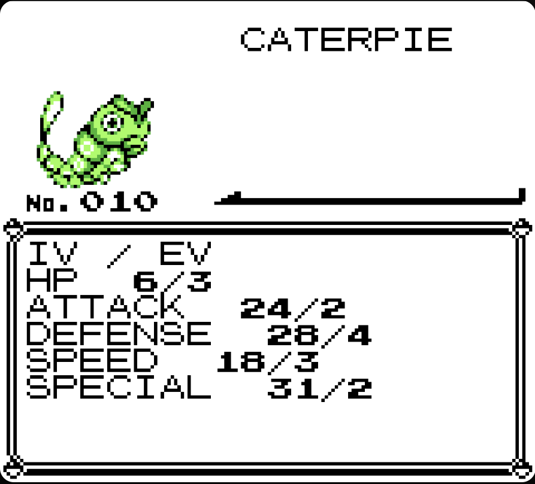
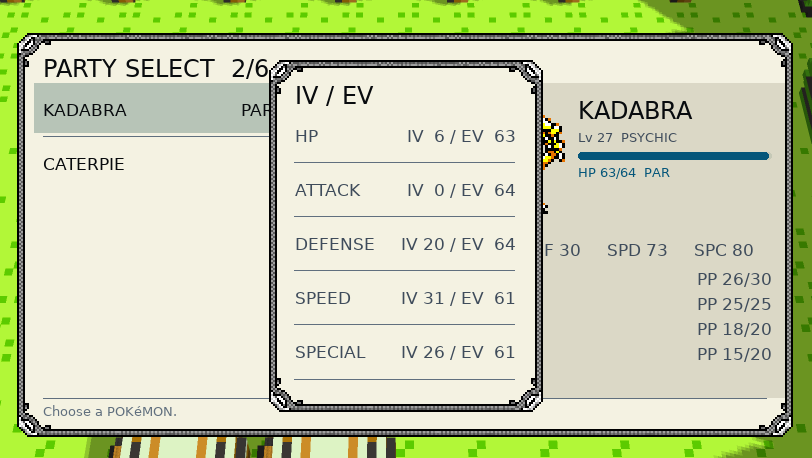

# HiddenStats

Adds a Summary screen page showing each Pokemon's hidden stats: **IVs**
(derived from its DVs, 0–31) and **EVs** (derived from Stat Exp, 0–255).

| Stat     | IV / EV      |
|----------|--------------|
| HP       | IV 26 / EV  16 |
| ATTACK   | IV 31 / EV 252 |
| DEFENSE  | IV 18 / EV   4 |
| SPEED    | IV 22 / EV   0 |
| SPECIAL  | IV 29 / EV 188 |

## How it renders

HiddenStats picks its rendering mode automatically at load time — no
configuration needed.

### 1. Standalone

No other mod required. Wraps the native `SummaryMenu` screen directly and
appends one extra page after whatever pages already exist.

  
   <em>The IV/EV page rendered on the native Summary screen (no other mod installed).</em>

### 2. Standalone + Gen1 Modern UI

If [Gen1 Modern UI](https://github.com/ArmstrongThomas/gen1-modern-ui) is also
installed, HiddenStats registers a small adapter that supplies just the extra
page — Gen1 Modern UI already fully models the native pages on its own, so
nothing else needs to change.

  
   <em>The IV/EV page rendered inside the Gen1 Modern UI Party Select overlay.</em>

### 3. With Kanto Reforged — Phase 2, not yet released

[Kanto Reforged](https://github.com/1Jamie/Kanto-Reforged) owns the
`SummaryMenu` screen itself (it adds its own ability/held-item page, both
natively and through Gen1 Modern UI), so HiddenStats steps aside rather than
fight over the same screen registration. Once a small compatibility hook
lands in Kanto Reforged (a pull request tracked as **Phase 2** of this
project), it will call into HiddenStats's `mod.exports.summaryPageModel` /
`drawSummaryPage` for its own extra page, and this mode will light up
automatically — no changes needed on this side.

## Installation

1. Drop the `hidden_stats` folder (or a zipped build of it) into your mods
   directory alongside your other mods.
2. Launch the game. Check the log for one of:
   - `HiddenStats: standalone native page installed`
   - `HiddenStats: Gen1 Modern UI page installed`
   - `HiddenStats: Kanto Reforged detected; running in compatibility-only mode`

## Compatibility

| Installed alongside      | Behavior                                                        |
|---------------------------|-------------------------------------------------------------------|
| Nothing else              | Adds the page to the native Summary screen.                       |
| Gen1 Modern UI            | Adds the page to both the native screen and the Modern UI overlay.|
| Kanto Reforged            | Waits for Kanto Reforged's compatibility hook (Phase 2, below).   |
| Kanto Reforged + Modern UI| Same — waits for the Phase 2 hook.                                 |

HiddenStats deliberately does not register its own `SummaryMenu` screen when
Kanto Reforged is present, since Kanto Reforged already owns that screen
(native rendering and its own Modern UI adapter) — registering a second,
competing handler for the same screen would be a race with no reliable
winner.

## Roadmap

- [x] Standalone native Summary page
- [x] Gen1 Modern UI adapter
- [ ] **Phase 2:** pull request against Kanto Reforged adding a small
      `mod.find("hidden_stats")` hook in its `SummaryMenu` wrapper, so the
      page shows up with Kanto Reforged's own header/theming instead of
      HiddenStats's fallback rendering.

## How the numbers are computed

- **IV** = `floor(DV * 31 / 15)` — maps a Gen 1/2 DV (0–15) onto the familiar
  Gen 3+ IV scale (0–31).
- **EV** = `floor(sqrt(Stat Exp))` — approximates the familiar EV scale
  (0–255) from raw Stat Exp (0–65535).
- **HP DV** isn't stored directly in Gen 1/2 — it's derived from the low bit
  of each of the other four DVs (Attack, Defense, Speed, Special).

## License

TBD.
